# Klasse 1

### Problem

- Parameteränderung in einem Live-Stück

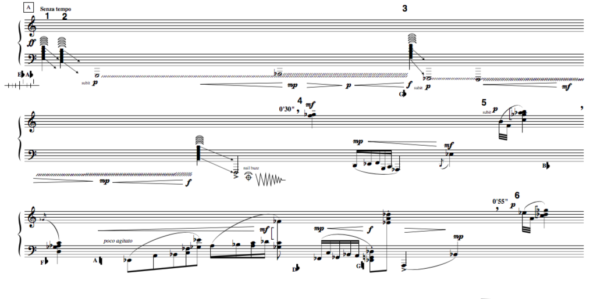

### Message Box
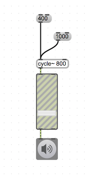

### Message Box ohne Patchcord

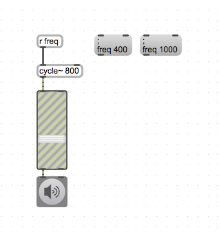

### Qlist

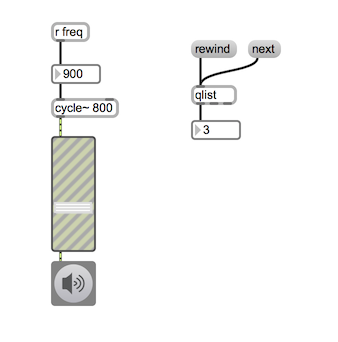
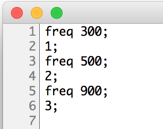

### Mehrere Parameter

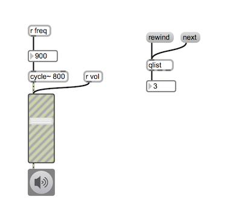
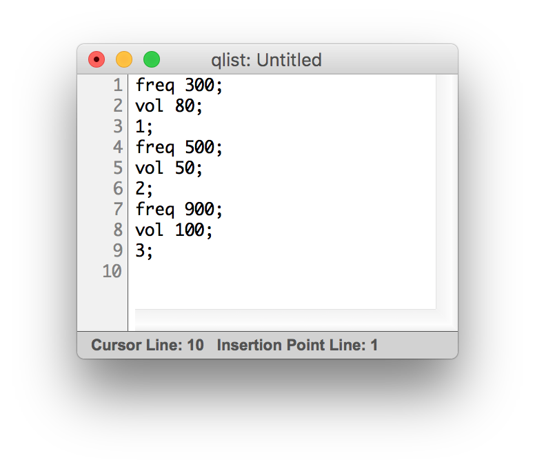

### Wie Qlist interpretiert den Text

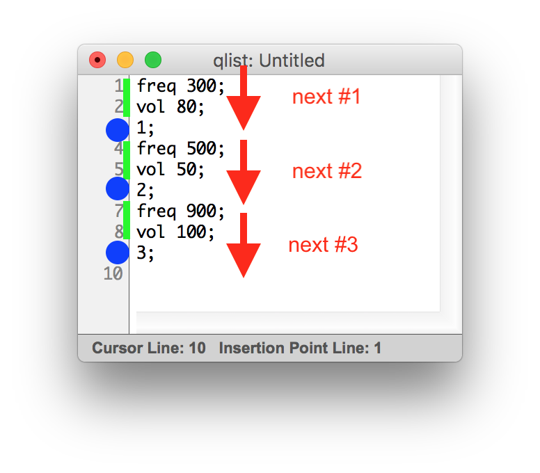

- eine Zahl am Anfang einer Zeile ... stopp
- ein Symbol am Anfang einer Zeile ... fortsetzen

### Ausgabe

- man kann eine Liste mit mehreren Zahlen vom Outlet ausgeben
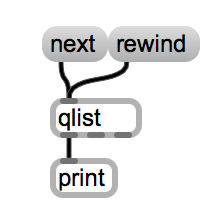
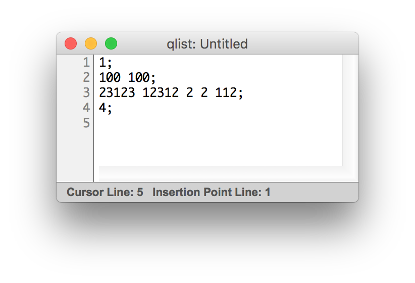

- man kann auch nach Zahlen Symbol schreiben
 und damit an ein "r"-Objekt eine Nachricht schicken.

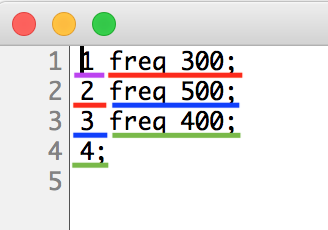

### Eine Sequenz mit Qlist
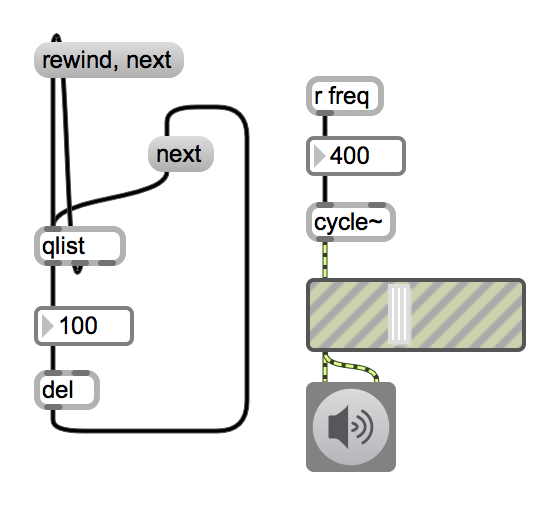

### Sequenz mit Unterbrechung

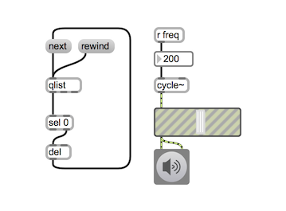
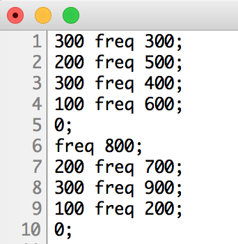

### Interpolation

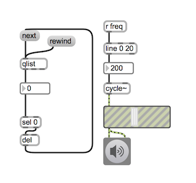

### Use Case
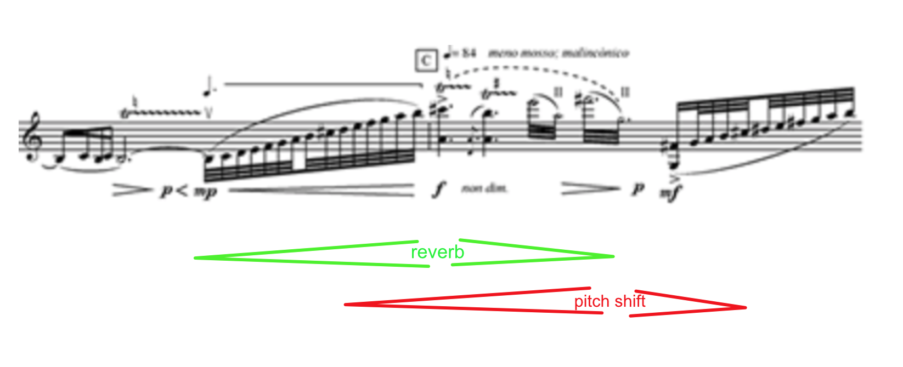

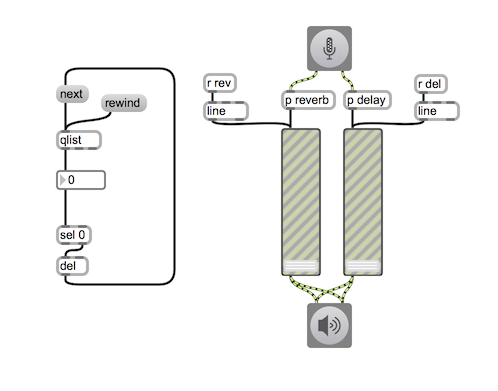
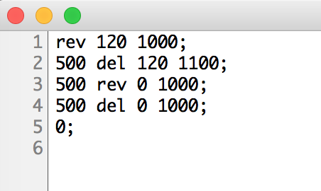

