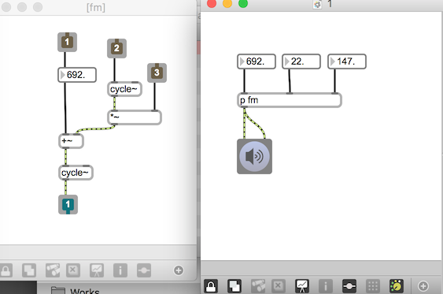
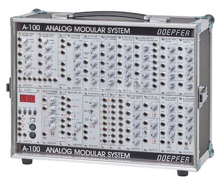

# Klasse 2

## Duplikation in Max

patcher / abstraction  / bpatcher /poly~

## 1 Patcher

### Vorteil von Patcher

- Verkapselung 
	- Man kann den Mechanismus/Algorithmus verstecken
	- Nur drei Parameter sind wichtig für Musiker
- Modularisierung
	- Bessere Wiederbenutzbarkeit (Kopie ist sehr einfach)
- Trennung von Interface und Algorithmus

- Mixer

## 2 Abstraction

## 3 Bpatcher

- Analog Synth Model (Interface + Klanggenerator immer zusammen)

- Modulate: Alex Rodigues (Analog Synthesizer Simulator)

### Vorteil
- einfach zu verstehen wegen der Analogie 
- 
### Nachteil
- nicht sehr flexibel 
- Fernbedinung mit qlist

## 4 Poly~

### Aufgabe

- Nehmen Sie 1 Sekunde sample auf
- Eine Sekunde später, spielen Sie die aufgenomenne Stimme 1000 mal gleichzeitig mit unterschiedlichen Tonhöhe.

### Probleme

- CPU aufwnedig
- Mühsam zu programmieren

