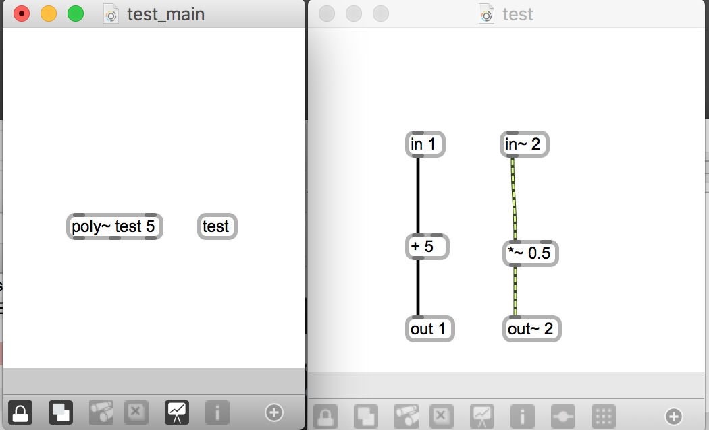
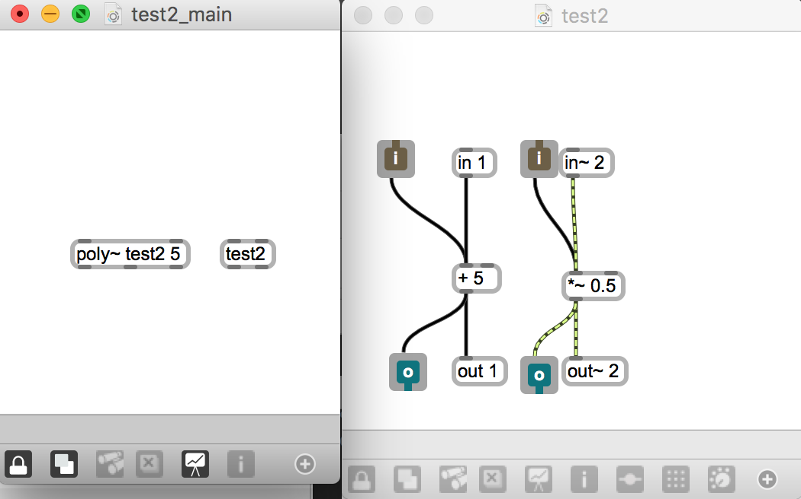

# Klasse 2

## Duplikation in Max

patcher / abstraction  / bpatcher /poly~

## 1 Patcher

### Vorteil von Patcher

- Verkapselung 
	- Man kann den Mechanismus/Algorithmus verstecken
	- Nur drei Parameter sind wichtig für Musiker
- Modularisierung
	- Bessere Wiederbenutzbarkeit (Kopie ist sehr einfach)
- Trennung von Interface und Algorithmus

- Mixer

### Softwarearchtektur / MVC-Muster

- Model ... Klangsynthese Algorithmus
- View ... Klang oder Visualisierung = Feedback für Benutzer
- Controller ... Sliders, Number Box = Interface

Model und Controller muss getrennt sein.

####  nicht MVC

#### mit MVC

[Cort Lippe Max Patches](http://www.cortlippe.com/compositions.html)

### Nachteil von MVC

- Schiffbarkeit

- hint objekt

## 2 Abstraction

Ähnlich wie Patcher aber keine Kopie sondern **Alias**.

### Basis

### Abstraction mit Buffer

#### Problem 
- Die Namen der Buffers müssen unterschiedlich sein.

#### Lösung
- "#1" "#2" ... Ersetzt durch Argumente

### Abstraction mit Argumenten

 

### Abstraction mit mehreren Argumenten 

 

### Abstraction mit #0 

 

- "#0" in Abstraction = Instanznummer = immer einzigartig
	- Nutzlich für automatische Bennenung z.B. "r" oder "s" oder "buffer"
	- "#0_buf" ist OK, aber "buf_#0" funktioniert nicht.
	- Man kann nicht Nummer als Name eines Buffers benutzen.

### Abstraction in Abstraction

- Man kann nicht in einem Abstraction dasselbe Abstraction benutzen.

### Abstraction und qlist

## 3 Bpatcher

- Analog Synth Model (Interface + Klanggenerator immer zusammen)

- [Modulate](https://github.com/alexrodi/Modulate-Synth/releases/): Alex Rodigues (Analog Synthesizer Simulator)

### Vorteil
- einfach zu verstehen wegen der Analogie 

### Nachteil
- nicht sehr flexibel 
	- zu enge Zusammenhang zwischen der Schnittstelle und dem Algorithmus
- Fernbedinung mit qlist

## Aufgabe

- Nehmen Sie 1 Sekunde sample auf
- Eine Sekunde später, spielen Sie die aufgenomenne Stimme **1000** mal gleichzeitig mit unterschiedlichen Tonhöhe ab.

### Probleme

- Aufwendig zu programmieren
- CPU aufwnedig

#### Max/MSP und die CPU-Auslastung

- Alle Tilde-Objekte berechnen, egal ob diese Objekte Verbindungen mit anderen Objekten haben.

## 4 poly~ objekt

- in, in~, out, out~ ... besondere inlet/outlet für poly~

**Idee von poly~**

### Abstraction mit in, in~, out, out~ als inlet / outlet

**Problem**

**Lösung**

## 5 r in poly~

### CPU Aufwand - mit 1000 Stimmen

## 6 Mute mit poly~

## 7 thispoly in poly~

- wie super collider

## 8 Der Begriff von "busy" Zustand

## 9 "Busy" zustand mit thispoly

## 10 Refaktorisierung

## 11 Beobachter 

- thispoly~ gibt die **Instanznummer** aus, wenn es einen Bang bekommt.

	