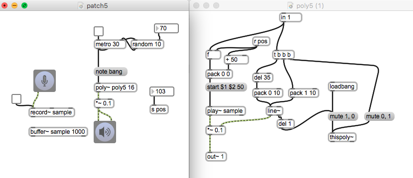
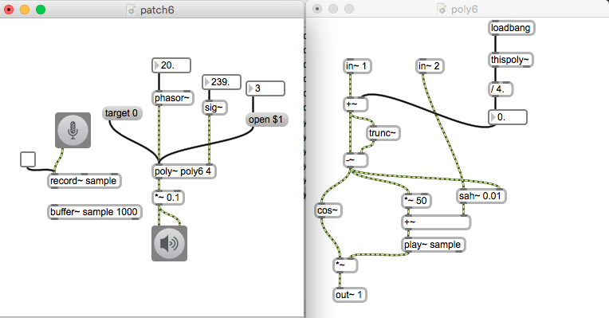
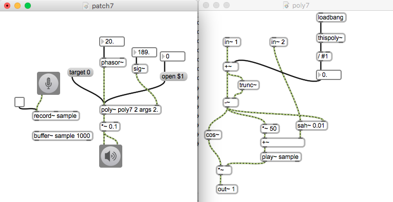
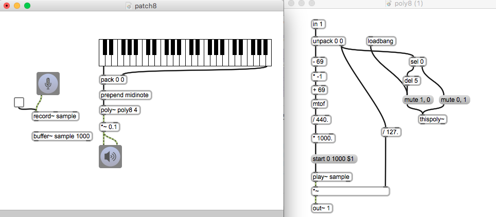

# Klasse 3

## weitere Möglichkeiten mit poly~ 

## 1 Random Delay

## 2 Ortung und poly~

- jede Instanz hat unterscheidliche Position

## 3 Klangwolke

- Ligeti?

## 4 Delay designer

- Kombination mit multislider

## 5 Asynchonous Granular mit poly~

- mit poly~ kann man leicht Problem von der Überlapung lösen

## 6 Synchrnous Granular mit poly~

- Instanznummer als Parameter für Phasenvershiebung

## 7 Args und poly~

- poly~ kann auch Argumente nehmen

## 8 Polyphonischer Synth mit poly~

- polyphonischer Synth mit MIDI keyboard
