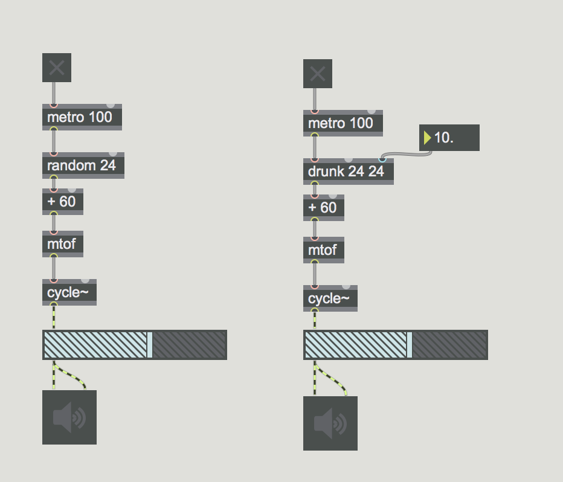
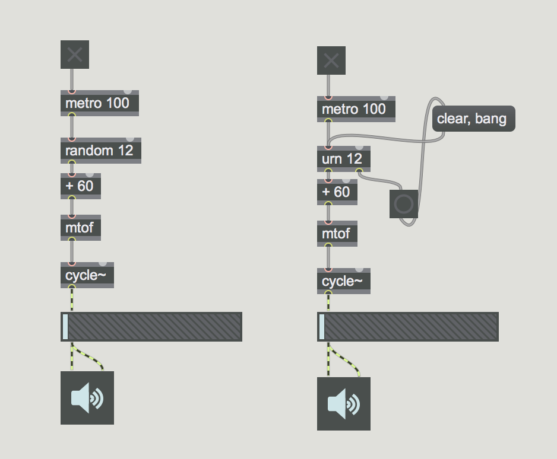

## Random in Max

- random ... random number generator
- drunk ... output random numbers within a step range
- urn ... generate random numbers without duplicates
- decide ... choose randomly between 1 and 0
- expr ... evaluate mathematical expression
- itable ... bang: select a value randomly based on the probablity
- table .. bang: select a value randomly based on the probablity

### Random und Drunk

### Ohne lange Töne

### Random und urn

### Ohne Wiederholung + urn

### Random und itable

### Stokastische Interpolation

### 2D Stokastieche Interpolation

### Umwandelung

### Interpretation

### Kondition

### Dynamische und Flexibel Kondition

## Random im Audiobereich

- noise~ ... white noise
- rand~ ... interpolated random
- pink~ ... pink noise
- sah~ ... sample and hold
- gen~
	- rand

### Markov Kette

[Markov Kette](https://de.wikipedia.org/wiki/Markow-Kette)

Eine Markow-Kette ist ein spezieller **stochastischer** Prozess. Eine Markow-Kette ist darüber definiert, dass auch durch Kenntnis einer nur begrenzten Vorgeschichte ebenso gute Prognosen über die zukünftige Entwicklung möglich sind wie bei Kenntnis der gesamten Vorgeschichte des Prozesses.

### Beispiel

### Analyse

**Melodie**

E Dis E Dis E H D C A C E A H E Gis H C E E Dis E Dis E H D C A C E A H E C H A H C D E H F E A F E S C E D C H E E E E Dis E Dis E Dis E Dis E H D C A C E A H E Gis H C E E Dis E Dis E Dis E H D C A C E A H C E C H A

**Zählung**

**Wahrscheinlichkeiten**
