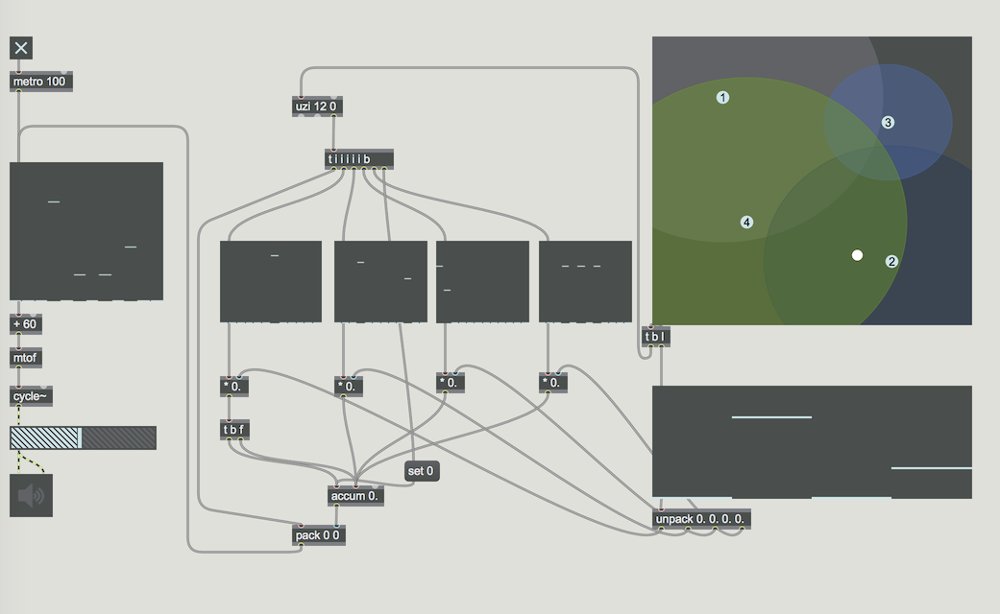

## Random in Max
- random ... random number generator
- drunk ... output random numbers within a step range
- urn ... generate random numbers without duplicates
- decide ... choose randomly between 1 and 0
- expr ... evaluate mathematical expression
- itable ... bang: select a value randomly based on the probablity
- table .. bang: select a value randomly based on the probablity

### Random und Drunk

### Ohne lange Töne

### Random und urn

### Ohne Wiederholung + urn

### Random und itable

### Stokastische Interpolation

### 2D Stokastieche Interpolation

### Umwandelung mit Coll

### Coll: refer

## Random im Audiobereich

- noise~ ... white noise (-1, 1)
- pink~ ... pink noise
- rand~ ... interpolated random
- sah~ ... sample and hold

### noise~ für Parameterkontroll

### down sampling

### stochastische Kontrolle mit Filter

### Interpolation Design

#### rampsmooth~ 
- linear interpolation

#### slide~
- logarithmisch interpolation

