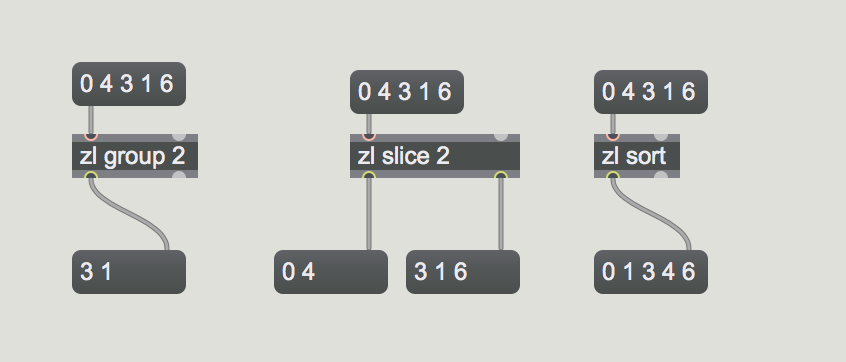
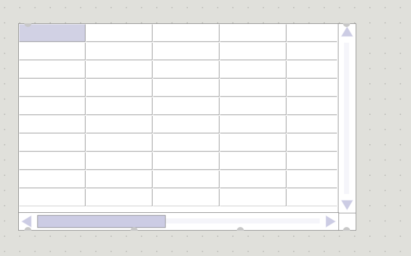
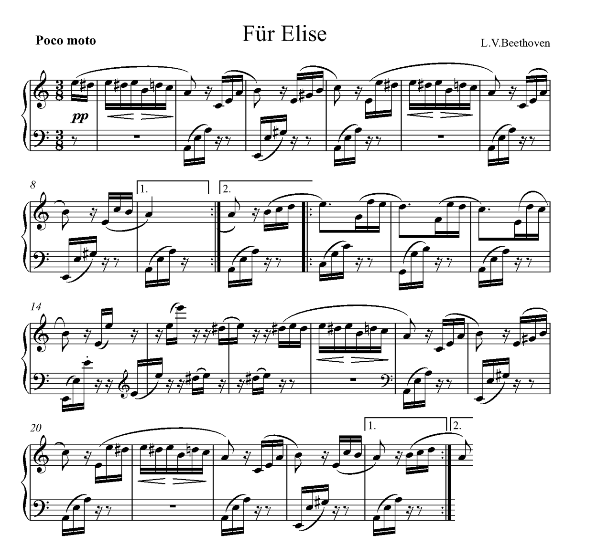
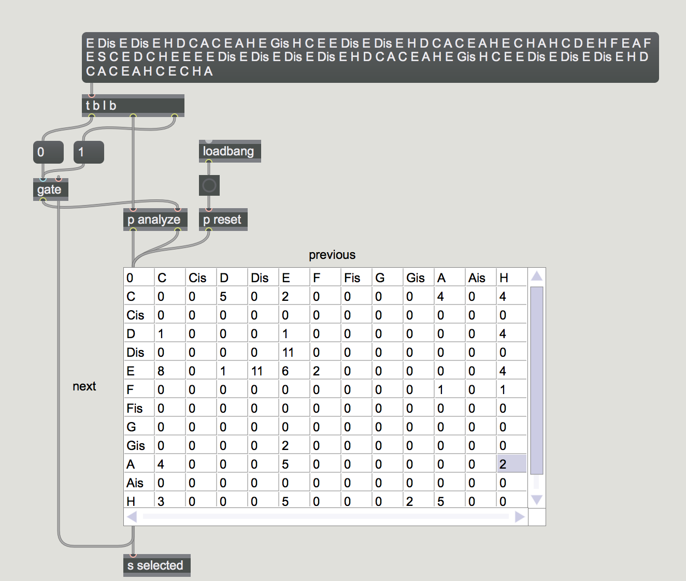
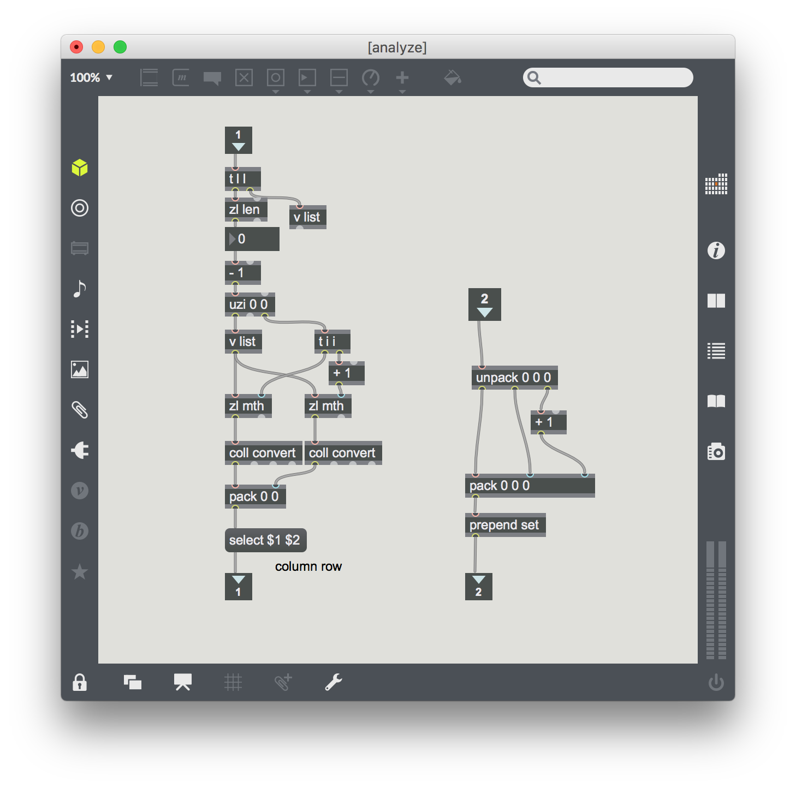
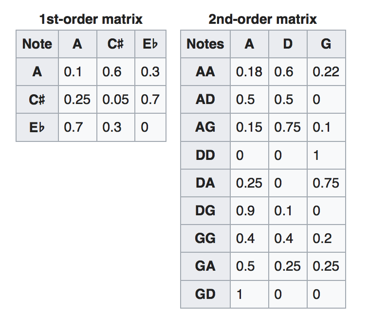
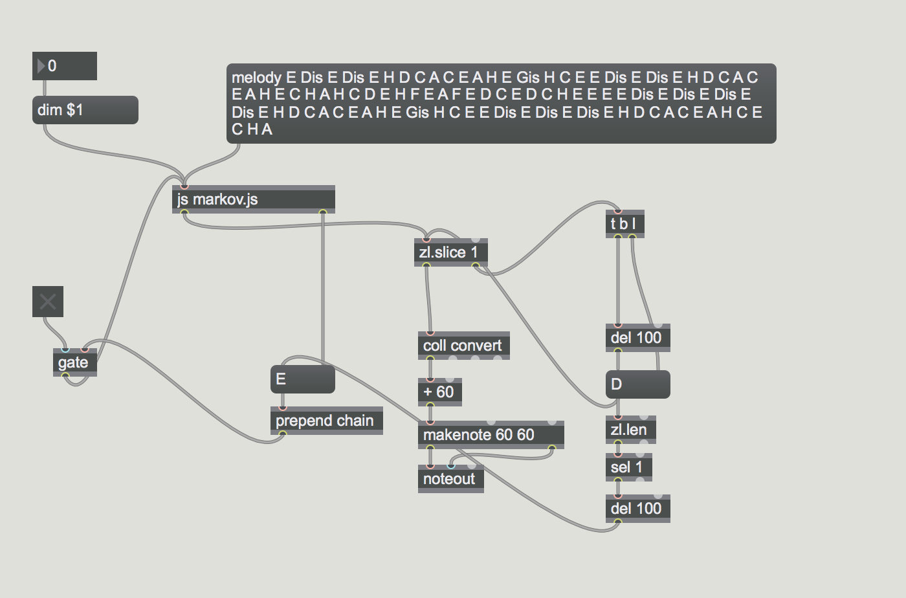

### zl objekt



### jit.cellblock



### Markov Kette

[Markov Kette](https://de.wikipedia.org/wiki/Markow-Kette)


Eine Markow-Kette ist ein spezieller **stochastischer** Prozess. Eine Markow-Kette ist darüber definiert, dass auch durch Kenntnis einer nur begrenzten Vorgeschichte ebenso gute Prognosen über die zukünftige Entwicklung möglich sind wie bei Kenntnis der gesamten Vorgeschichte des Prozesses.

### Abendessen

Steak -> Kein -> Pasta -> Salat -> Maultasche -> Wurst -> Burger -> Salat -> Steak -> Kein -> Schnitzel -> Pasta -> Salat -> Spätzle -> Thai Nudeln -> Pasta -> Salat -> Steak -> Suppe -> Wurst -> Flammkuchen 


#### Analyze der Tendenz:

- 2x Steak -> Kein  (66,6%)
- 1x Steak -> Suppe (33,3%)

--
- 3x Pasta -> Salat (100 %)


### Mit Musik



### Analyse

**Melodie**

E Dis E Dis E H D C A C E A H E Gis H C E E Dis E Dis E H D C A C E A H E C H A H C D E H F E A F E D C E D C H E E E E Dis E Dis E Dis E Dis E H D C A C E A H E Gis H C E E Dis E Dis E Dis E H D C A C E A H C E C H A

**Zählung**



**1st order**


### Second Order

- benutzt zwei Noten





```

var dimension = 2;
var collection = {};
outlets = 2;

function dim(d){
	dimension = d;
}

function chain(){
	var note = arrayfromargs(arguments)[0];
	var candidates = [];
	for(var i =0 ; i < collection.length; i++){
		if(collection[i].keyArray[0] == note){
			candidates.push(collection[i].keyArray);
		}
	}
	if(candidates.length == 0){
		post("no candiate");
		return;
	}
	var chosenKey = candidates[getRandomInt(candidates.length)];
	var prob;
	for(var j =0 ; j < collection.length; j++){
		if(compareArray(collection[j].keyArray, chosenKey)){
			prob = collection[j];
		}
	}
	var total = 0;
	for(var n in prob){
		if(n == "keyArray") continue;
		total += prob[n];
	}
	var choice = getRandomInt(total);
	var chosenNote;
	total = 0;
	for(var n in prob){
		if(n == "keyArray") continue;
		chosenNote = n;
		total += prob[n];
		if(choice < total){
			break;
		}
	}
	outlet(0, chosenKey);
	outlet(1, chosenNote);
}


function getRandomInt(max) {
    return Math.floor(Math.random() * max);
}

function compareArray(arrayA, arrayB){
	if(arrayA.length != arrayB.length){
		return false;
	}
	for(var i = 0; i < arrayA.length; i++){ 
		if(arrayA[i] != arrayB[i]){
			return false;
		}
	}
	return true;
}

function melody(){
	collection = [];
	var notes = arrayfromargs(arguments);
	for(var i = 0; i < notes.length - dimension -1; i++){
		var part = [];
		for(j = 0; j < dimension; j++){
			var note = notes[i+j];
			part.push(note);
		}
		var adjNote = notes[i+dimension];
		
		var exist = false;
		for(var j =0 ; j < collection.length; j++){

			if(compareArray(collection[j].keyArray, part)){
				
				if(!collection[j][adjNote]){
					collection[j][adjNote] = 1;
				}else{
					collection[j][adjNote]++
				}
				exist = true;
				break;
			}
		}
		
		if(!exist){
			var obj = {};
			obj.keyArray = part;
			obj[adjNote] = 1;
			collection.push(obj);
		}	
	}
	
	for(var i = 0; i < collection.length; i++){
 		var obj = collection[i];
		for(var k in obj){
			post(k + ":" + obj[k]); 
		}
		post("\n");
	}
}
```


