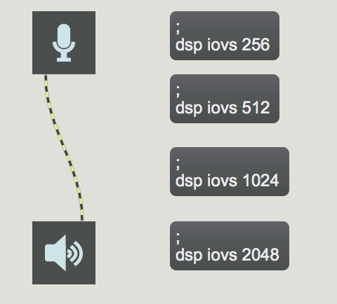
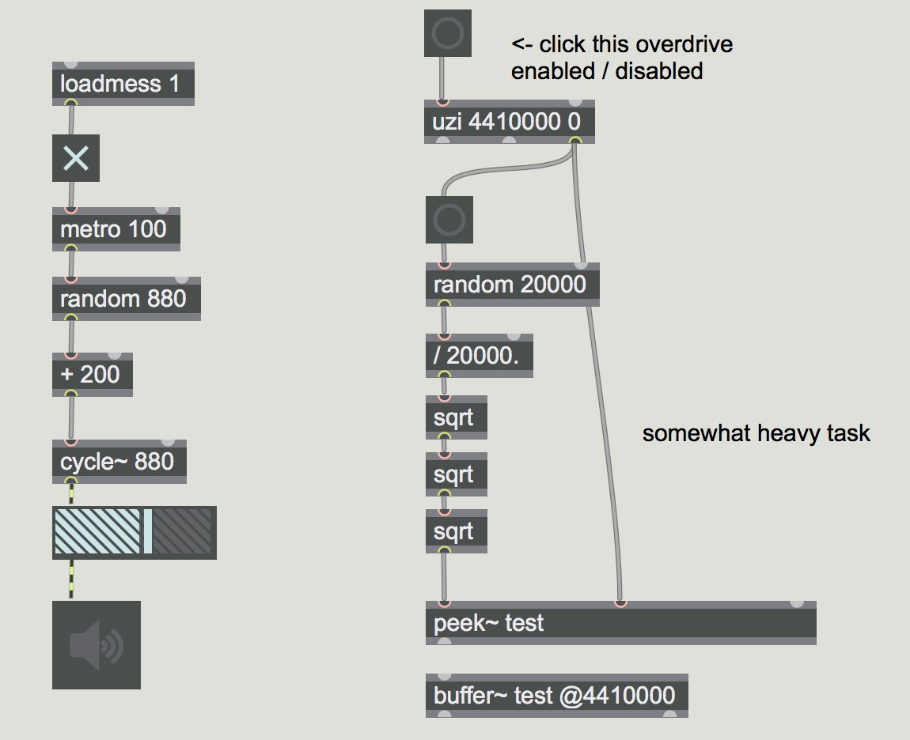
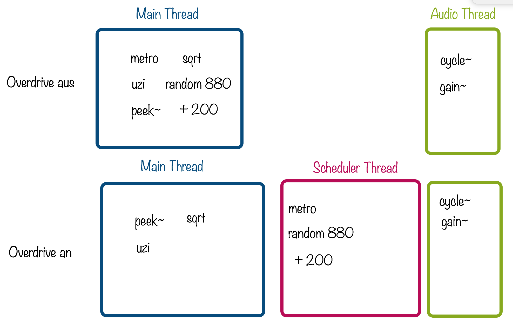
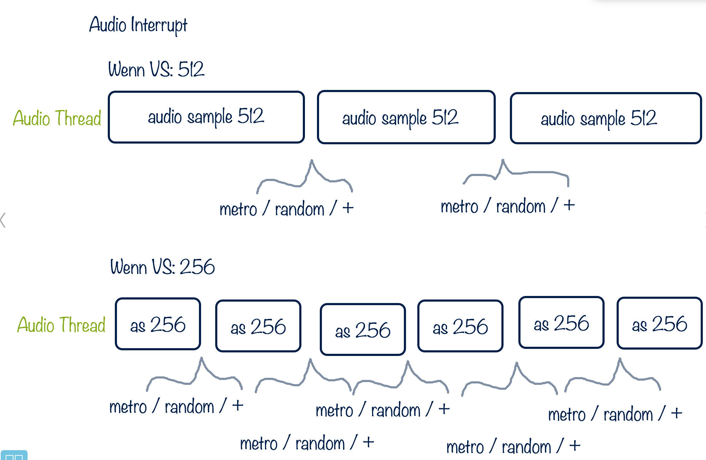
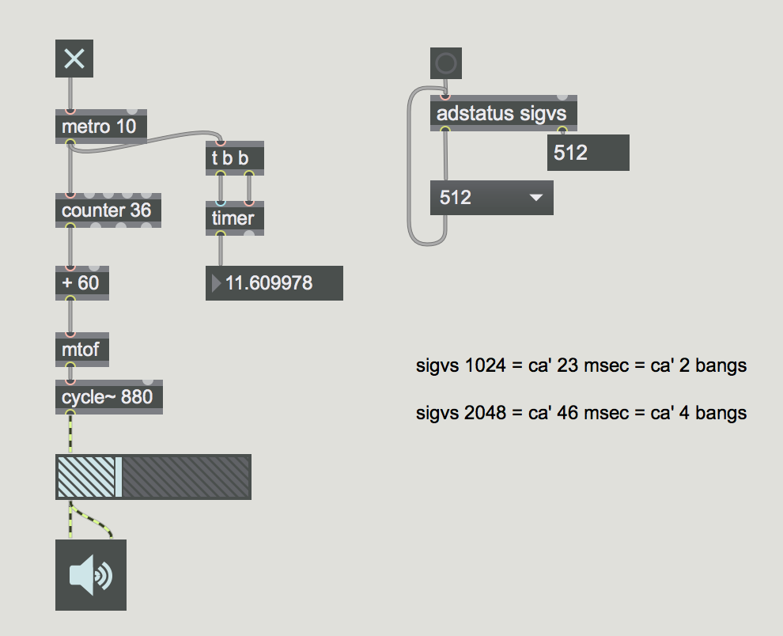
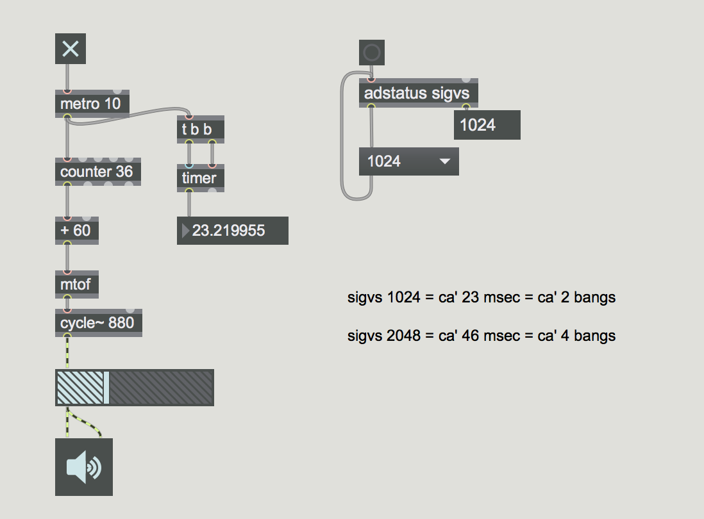

Weitere Programmierungstechniken von Softwareentwicklung

## SIAI entmystifiziert

### IO Vectorsize

The I/O Vector Size (I/O stands for input/output) controls the number of samples that are transferred to and from the audio interface at one time.

- Je größer Vectorsize ist, desto länger Latenz.
- io vector size 512 ist schon erkenbar als Delay
- für Live-Elektronik : 256 Samples (6 msek.) oder weniger

#### test patch

### vector size
The Signal Vector Size sets the number of samples that are calculated by MSP objects at one time. This can be less than or equal to the I/O Vector Size, but not more. If the Signal Vector Size is less than the I/O Vector Size, MSP calculates two or more signal vectors in succession for each I/O vector that needs to be calculated. 

### Scheduler in overdrive

#### Test Patch

#### Threads 

### Warum ist Vector Size sehr wichtig?

- Alle Tilde Objekte akzeptiert keine neue Control-Werte bis Ende eines Vectors.

### SIAI (Scheduler in Audio Interrupt)

